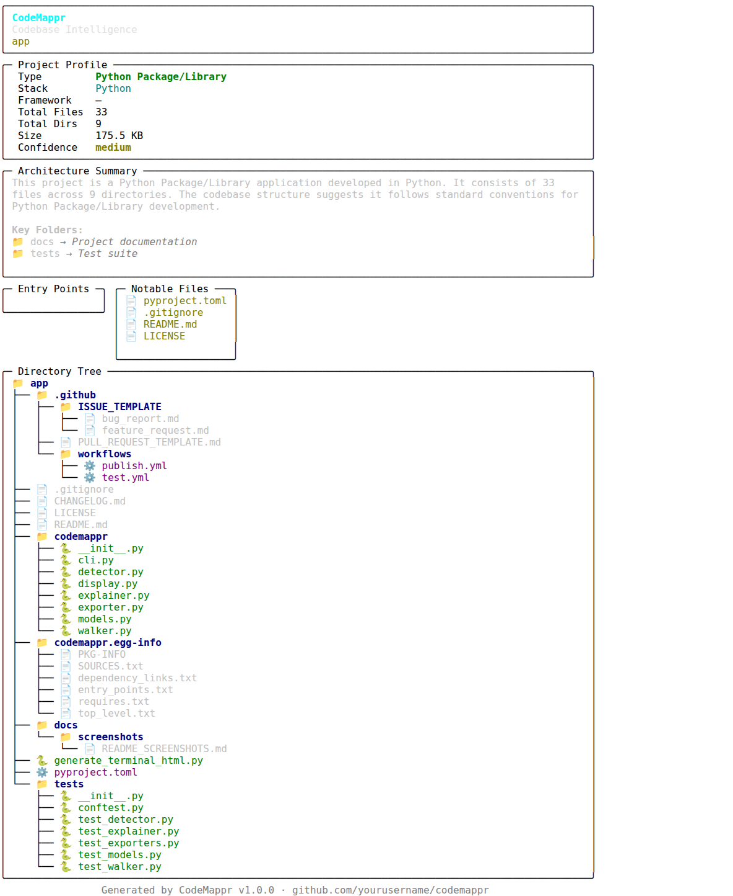
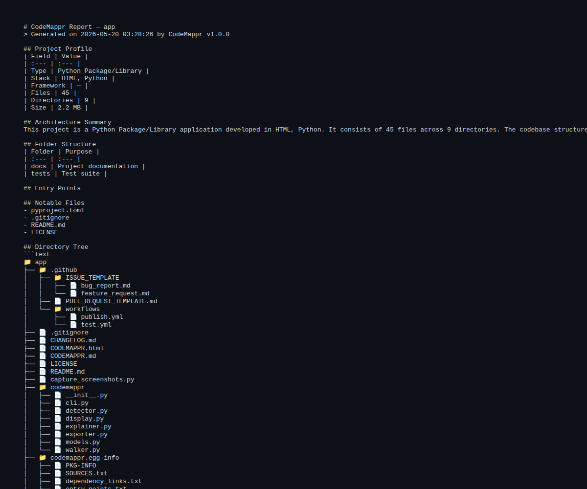
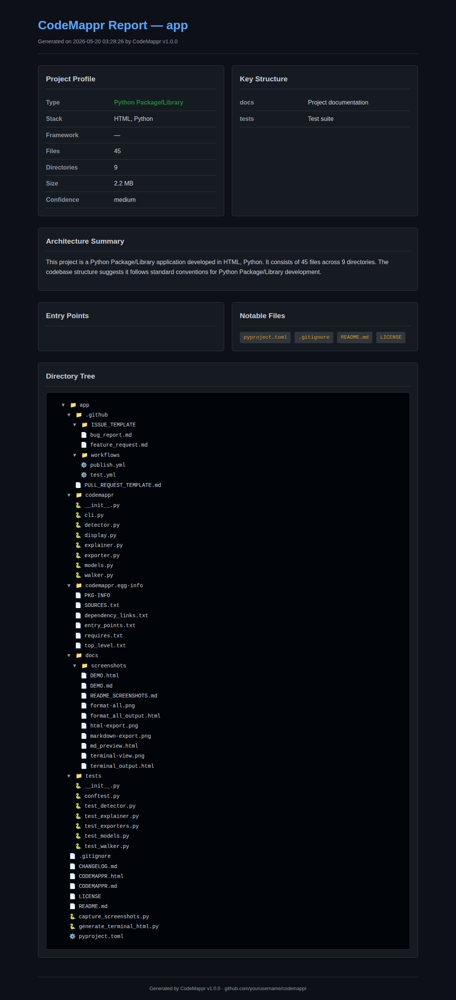
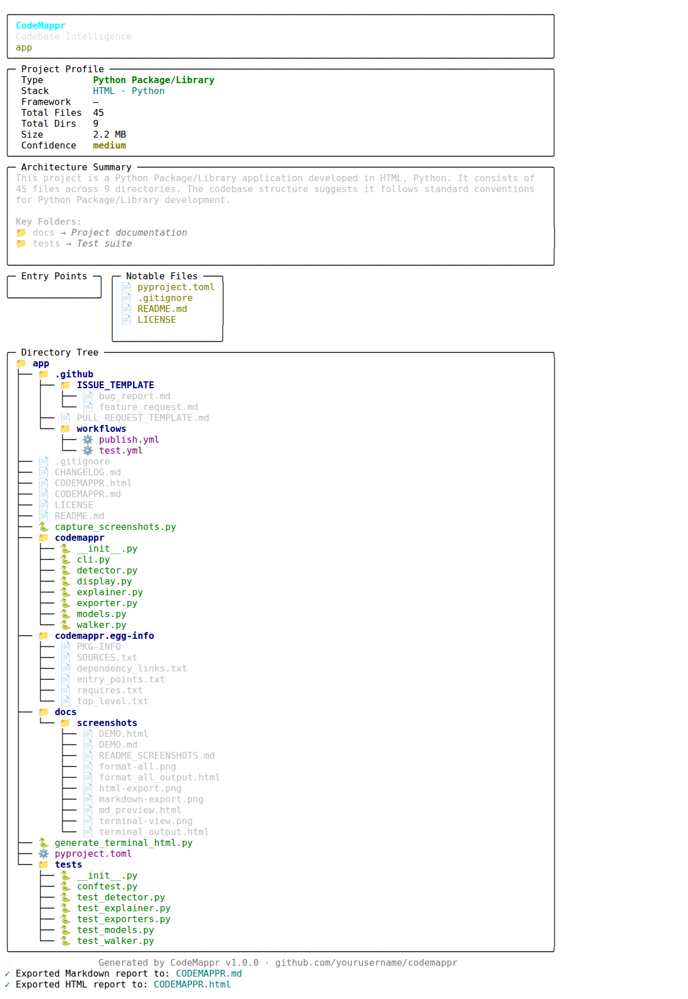

# CodeMappr 🗺️
> Instantly understand any codebase. One command.


## What is CodeMappr?
CodeMappr is a powerful CLI tool designed to give you an instant, high-level understanding of any codebase. Whether you're jumping into a new repository for the first time or documenting an existing one, CodeMappr scans the directory structure, detects the project type, identifies the language stack, and summarizes the architecture in seconds.

Unlike many other tools, CodeMappr works entirely offline and requires no API keys. It uses heuristic-based signals to identify over 20 different project types and supports universal language detection. With three distinct output formats—interactive Terminal dashboard, portable Markdown, and a beautiful dark-themed HTML report—CodeMappr is the perfect companion for every developer's toolkit.

## Demo

**Screenshot 1 — Terminal View**


**Screenshot 2 — Markdown Export**


**Screenshot 3 — HTML Export**


**Screenshot 4 — All formats at once**


## Installation
```bash
pip install codemappr
```

## Quick Start
```bash
# Scan current directory
codemappr scan

# Scan a specific path
codemappr scan /path/to/project

# Export as markdown
codemappr scan --format md

# Export as HTML
codemappr scan --format html

# Export everything at once
codemappr scan --format all

# Limit depth
codemappr scan --depth 3

# Ignore patterns
codemappr scan --ignore ".cache,temp"
```

## Output Formats

### Terminal
A rich, color-coded dashboard displayed directly in your terminal, featuring panels for project profiles, architectural summaries, and a styled directory tree.

### Markdown
A portable `CODEMAPPR.md` file perfect for inclusion in pull requests, project documentation, or sharing via GitHub/GitLab.

### HTML
A standalone, interactive `CODEMAPPR.html` report with a dark theme and collapsible directory trees for deep exploration of large codebases.

## Supported Project Types

| Project Type | Detection Signals |
|--------------|-------------------|
| **Monorepo** | Presence of `packages/`, `apps/`, or `libs/` with multiple project configs. |
| **React/Next.js** | `package.json` with `next` or `react` dependencies, or `next.config.js`. |
| **Vue.js** | `vue.config.js` or presence of `.vue` files (e.g., `App.vue`). |
| **Angular** | `angular.json` configuration file and standard `src/app` structure. |
| **Node.js API** | `package.json` with entry points like `index.js`, `server.js`, or `app.js`. |
| **Python Django** | `manage.py` script along with `settings.py` and `urls.py`. |
| **Python FastAPI/Flask** | `main.py` or `app.py` with corresponding framework dependencies. |
| **Python Package/Library** | Presence of `pyproject.toml` or `setup.py`. |
| **Rust** | `Cargo.toml` manifest file. |
| **Go** | `go.mod` module file. |
| **Java/Spring** | `pom.xml` (Maven) or `build.gradle` (Gradle) files. |
| **Android** | Presence of `AndroidManifest.xml`. |
| **Flutter/Dart** | `pubspec.yaml` manifest file. |
| **Ruby on Rails** | `Gemfile` plus `config/routes.rb` and standard `app/` directory. |
| **PHP/Laravel** | `composer.json` and the `artisan` CLI tool. |
| **Docker-based** | Presence of `Dockerfile` or `docker-compose.yml`. |
| **Data Science/ML** | `.ipynb` notebooks or `notebooks/` directory with DS libraries (pandas, etc.). |
| **Static Site** | Presence of a root `index.html` without heavy framework signals. |
| **Generic Python** | Fallback for projects primarily using `.py` files. |
| **Generic JS/TS** | Fallback for projects primarily using `.js` or `.ts` files. |

## Roadmap
- **v1.0.0** ✅ Core scanning, detection, terminal + export
- **v2.0.0** 🔜 File relationship map
- **v3.0.0** 🔜 Structural diff / changelog

## Contributing
We welcome contributions! To contribute:
1. Fork the repository.
2. Create a new branch for your feature or bugfix.
3. Ensure all tests pass by running `pytest`.
4. Submit a pull request with a detailed description of your changes.

All new features should be accompanied by relevant tests and documentation updates.

## License
MIT
